# Práctica No.2
## Introducción a la Programación y Computación 2
### Vacaciones Junio 2024
```js
Universidad San Carlos de Guatemala
Facultad de Ingeniería
Nombre: Angely Lucrecia García Martínez
Carne: 202210483
```
---
## Endpoint /cargarLibros
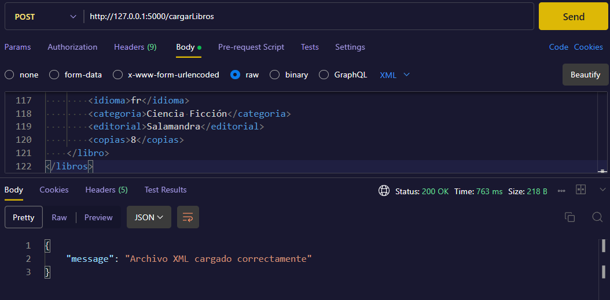

## Endpoint /verLibros
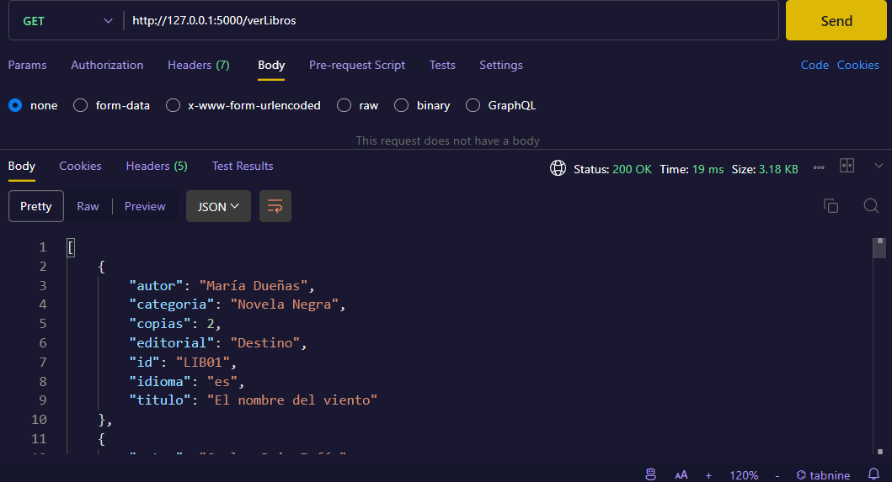
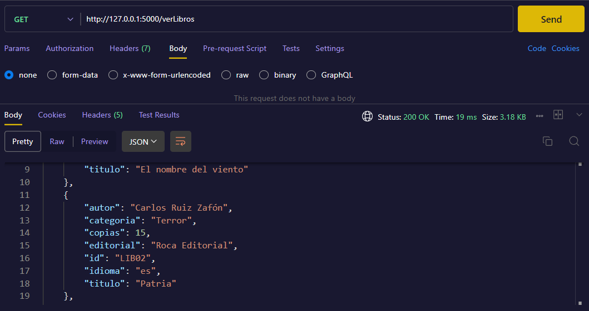
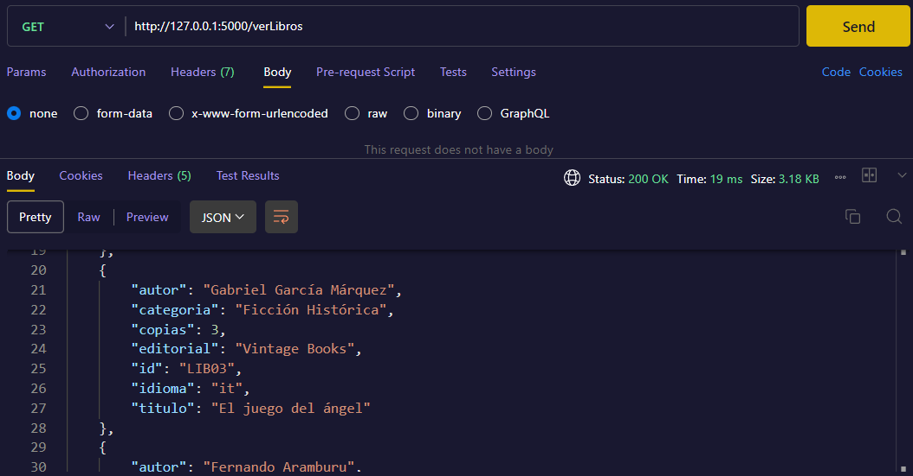


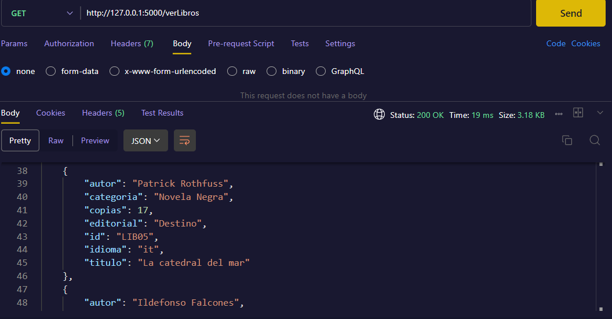
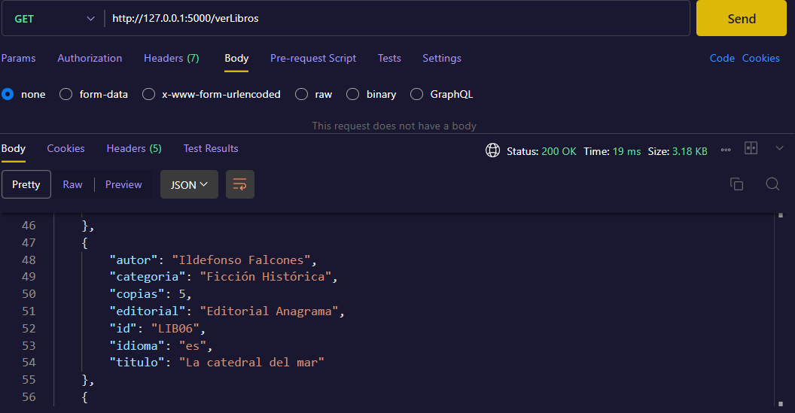

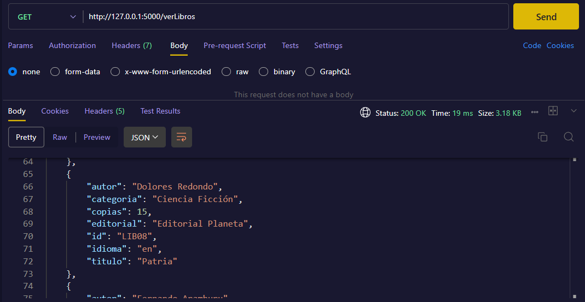
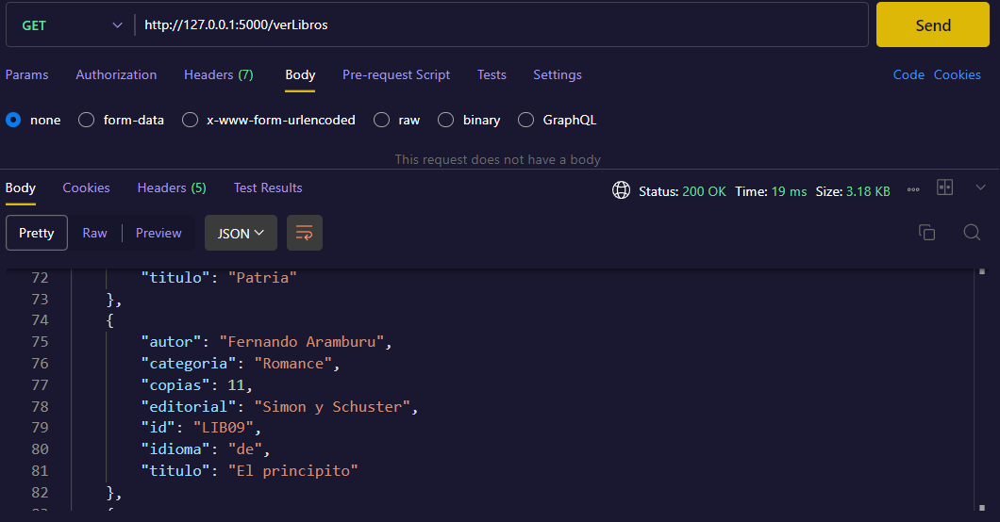
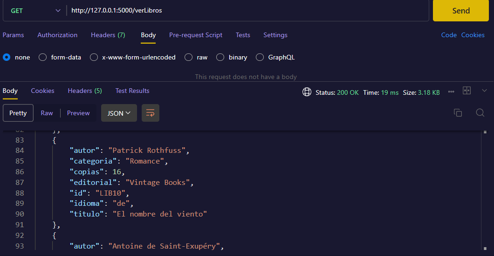

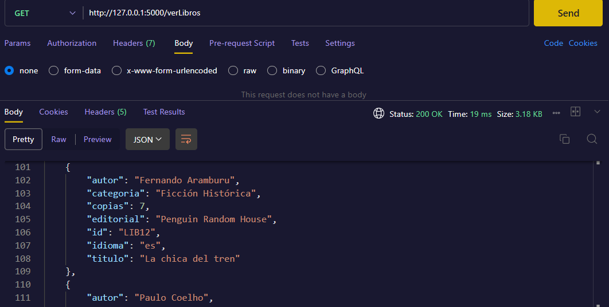
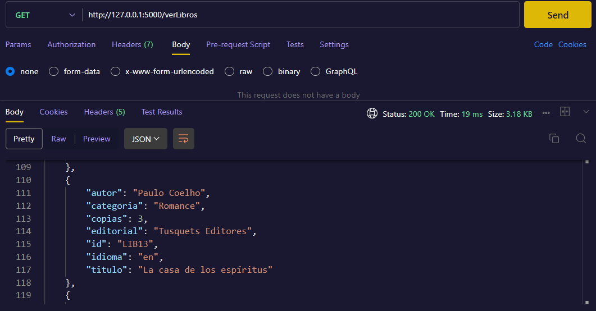

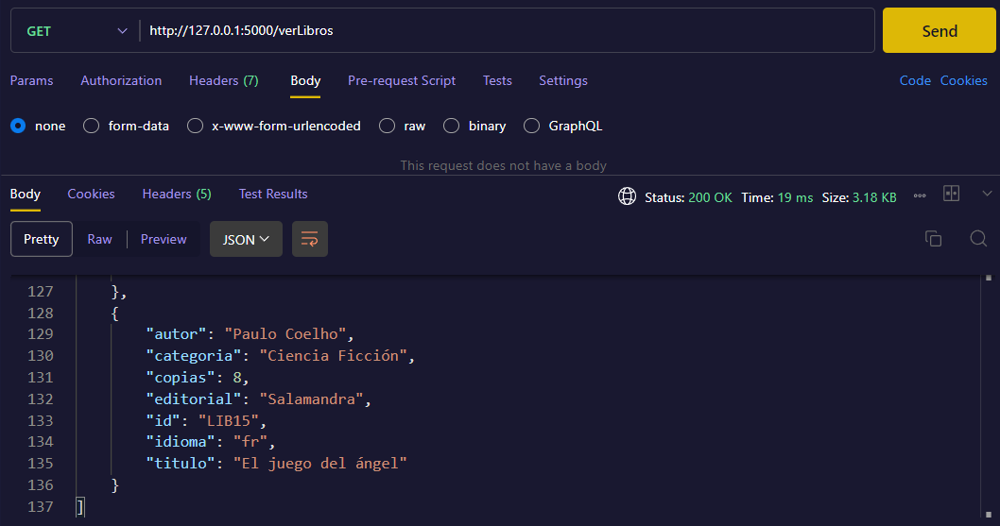

## Endpoint /verLibro:id
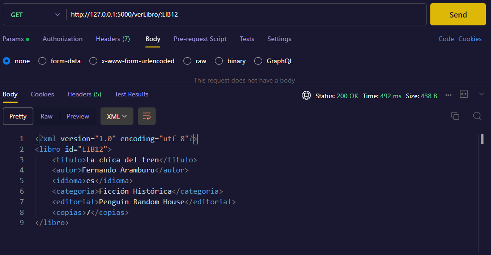

## Endpoint /libros/:categoria


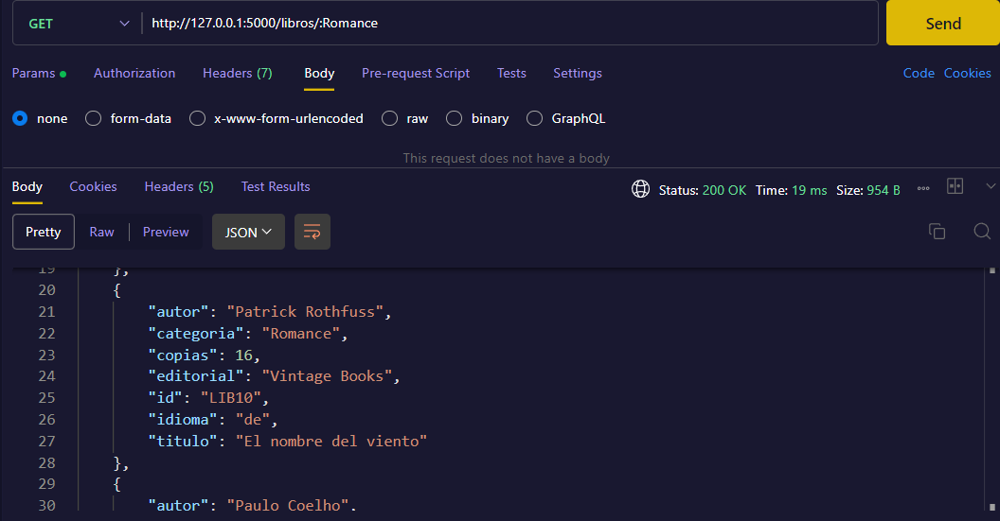
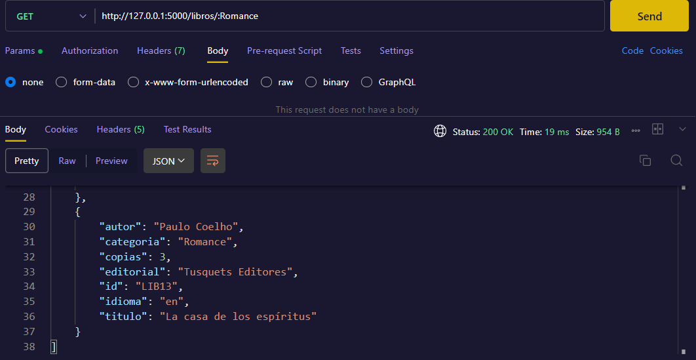

